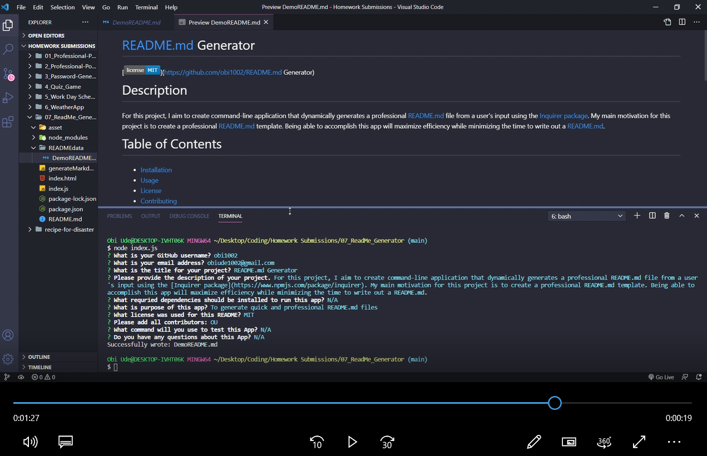

* [Acceptance Criteria](#acceptancecriteria)
* [Project Status](#projectstatus)
* [License](#license)
* [Deployment](#deployment)
* [Usage](#usage)
* [Preview of the App](#previewApp)

# ReadMe_Generator
 
For this project, I aim to create command-line application that dynamically generates a professional README.md file from a user's input using the [Inquirer package](https://www.npmjs.com/package/inquirer). My main motivation for this project is to create a professional README.md template. Being able to accomplish this app will maximize efficiency while minimizing the time to write out a README.md.     

# Acceptance Criteria
GIVEN a command-line application that accepts user input
WHEN I am prompted for information about my application repository
THEN a high-quality, professional README.md is generated with the title of my project and sections entitled Description, Table of Contents, Installation, Usage, License, Contributing, Tests, and Questions
WHEN I enter my project title
THEN this is displayed as the title of the README
WHEN I enter a description, installation instructions, usage information, contribution guidelines, and test instructions
THEN this information is added to the sections of the README entitled Description, Installation, Usage, Contributing, and Tests
WHEN I choose a license for my application from a list of options
THEN a badge for that license is added near the top of the README and a notice is added to the section of the README entitled License that explains which license the application is covered under
WHEN I enter my GitHub username
THEN this is added to the section of the README entitled Questions, with a link to my GitHub profile
WHEN I enter my email address
THEN this is added to the section of the README entitled Questions, with instructions on how to reach me with additional questions
WHEN I click on the links in the Table of Contents
THEN I am taken to the corresponding section of the README

# Project Status
This project was completed on April 3, 2021. 

# License
MIT

# Deployment
[Link](https://drive.google.com/file/d/1QxYfx4GaXml1I5EGN5ZJRp8bFNJWp6gG/view?usp=sharing) 

# Usage
When you open the terminal, you will be prompted to answer a few a live search bar to enter a city of your choice.  Once you enter the city, you can click on the magnifying glass button to the right of the search bar to load the results.  The current city information should be on display and a 5-days forecast should generate under the city display with additional weather forecast. Enjoy your new weather forecast app for any city of your choice!

<!-- Add screenShot -->
# Preview of the App
* This is how the app looks
[] (https://drive.google.com/file/d/1QxYfx4GaXml1I5EGN5ZJRp8bFNJWp6gG/view?usp=sharing)